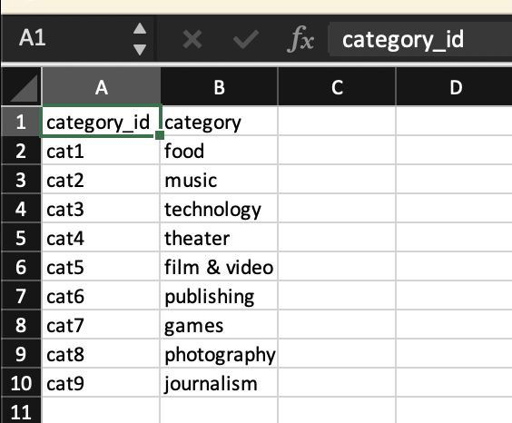
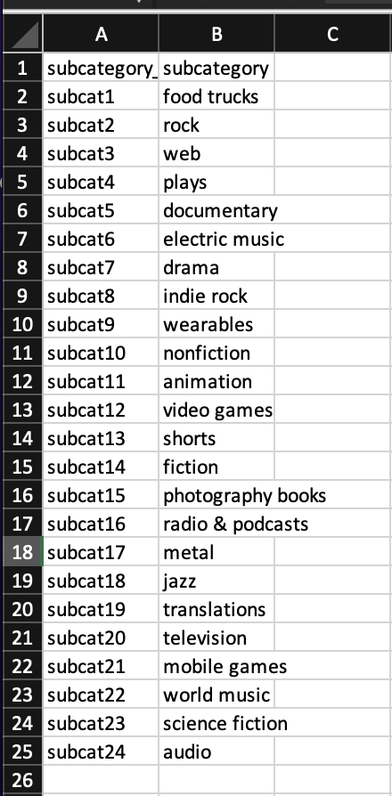
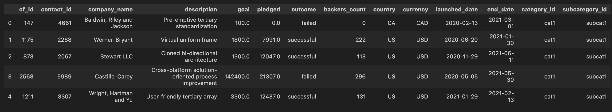
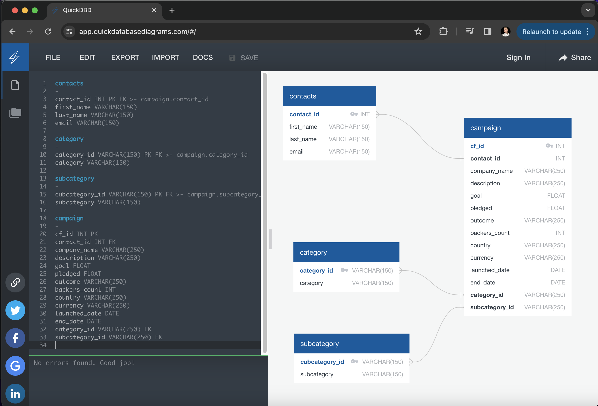

# Crowdfunding_ETL 
*In this project, I will utilize Jupyter Notebook to manipulate and extract data from Excel spreadsheets. The objective is to transform the data into separate CSV files, facilitating subsequent loading and manipulation within a SQL environment*

# Background
For our ETL mini project, my partners and I will collaborate to build an ETL pipeline using Python, Pandas, and either Python dictionary methods or regular expressions for data extraction and transformation. Once the data is transformed, we'll generate four CSV files. These files will then be used to create an Entity-Relationship Diagram (ERD) and a table schema. Finally, we'll upload the data from the CSV files into a Postgres database.

This new assignment consists of two technical products. You will submit the following deliverables:

* Creating the Category and Subcategory DataFrames
* Creating the Campaign DataFrame
* Creating the Contacts DataFrame
* Creating the Crowdfunding Database

## Creating the Category and Subcategory DataFrames
I started with importing all the required dependencies.

* Then, I extracted and transformed `crowdfunding.xlsx` Excel data to create a Category DataFrame with specific columns.

* I exported the category DataFrame as `category.csv`

* I extracted and transformed `crowdfunding.xlsx` Excel 
data to create a Subcategory DataFrame with specific columns.

* I exported the category DataFrame as `subcategory.csv`

## Creating the Campaign DataFrame
* I extracted and transformed `crowdfunding.xlsx` Excel 
data to create a Campaign DataFrame with specific columns, which included:
    ~ The "cf_id" column
    ~ The "contact_id" column
    ~ The "company_name" column
    ~ The "blurb" column, renamed to "description"
    ~ The "goal" column, converted to the float data type
    ~ The "pledged" column, converted to the float data type
    ~ The "outcome" column
    ~ The "backers_count" column
    ~ The "country" column
    ~ The "currency" column
    ~ The "launched_at" column, renamed to "launch_date" and with the UTC times converted to the datetime format
    ~ The "deadline" column, renamed to "end_date" and with the UTC times converted to the datetime format
    ~ The "category_id" column, with unique identification numbers matching those in the "category_id" column of the category DataFrame
    ~ The "subcategory_id" column, with the unique identification numbers matching those in the "subcategory_id" column of the subcategory DataFrame

* I re-named required columns 

* I exported the category DataFrame as `campaign.csv`

## Creating the Contacts DataFrame

#### Option 1: Use Python dictionary methods.
* I started with importing the `contacts.xlsx` file into a DataFrame.

* I iterated through the DataFrame, converting each row to a dictionary.

* Then I iterated through each dictionary, doing the following:
~ Extracting the dictionary values from the keys by using a Python list comprehension.
~ Adding the values for each row to a new list.

* Created a new DataFrame that contains the extracted data.

* Split each "name" column value into a first and last name, and place each in a new column.

* Cleane and exported the DataFrame as `contacts.csv`.

#### Option 2: Use regular expressions.
* I imported the `contacts.xlsx` file into a DataFrame.

* Extracted the "contact_id", "name", and "email" columns by using regular expressions.

* I created a new DataFrame with the extracted data.

* I converted the "contact_id" column to the integer type.

* I split each "name" column value into a first and a last name, and place each in a new column.

* I cleaned and then exported the DataFrame as contacts.csv and save it to your GitHub repository.

## Created the Crowdfunding Database in SQL
* Inspected the four CSV files, and then sketched an ERD of the tables by using QuickDBDLinks to an external site.

* Used the information from the ERD to create a table schema for each CSV file.

* Saved the database schema as a Postgres file named crowdfunding_db_schema.sql, and saved it to your GitHub repository.

* Created a new Postgres database, named crowdfunding_db.

Using the database schema, create the tables in the correct order to handle the foreign keys.

* Verified the table creation by running a SELECT statement for each table.

* Imported each CSV file into its corresponding SQL table.

* Verified that each table has the correct data by running a SELECT statement for each.

#### Technologies used
* *Visual Studio Code*
* *Excel* 
* *GitHub* 
* **SQL**
* *JupyterNotebook*
* *JSON*

Cover photo source: https://www.techmagic.co/blog/how-to-start-a-crowdfunding-website-like-kickstarter/